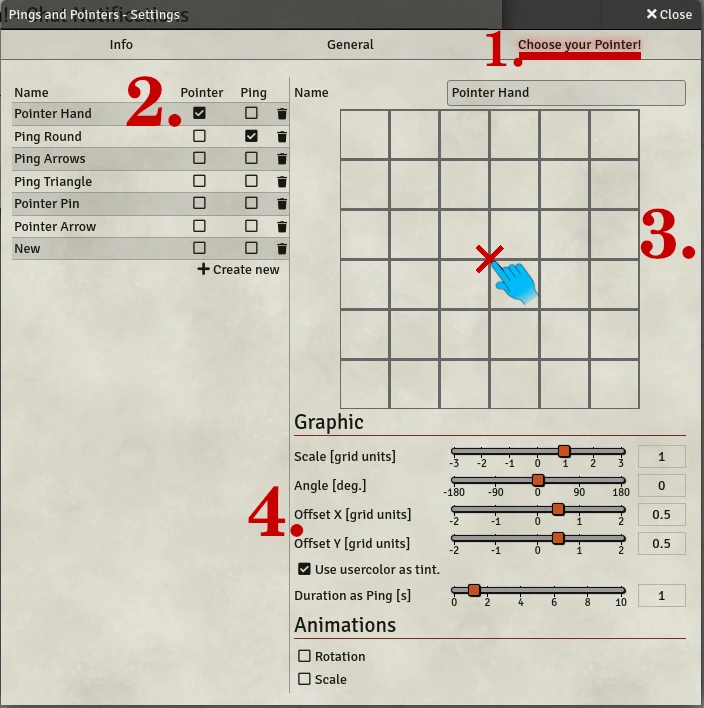
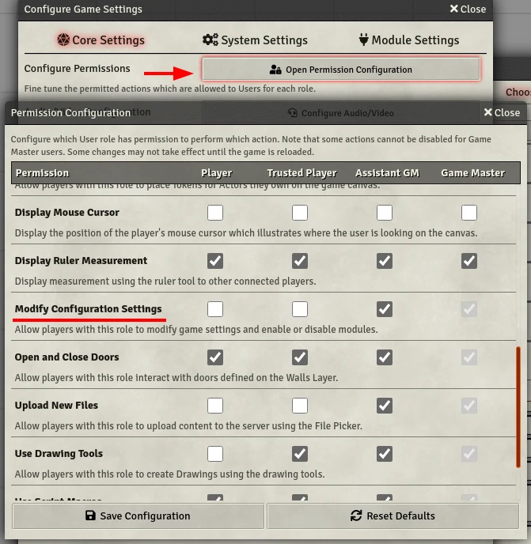

# PnP - Pings and Pointer
    

Gives all players the option to show a customizable cursor on demand, as well as ping any location with a custom ping!  
Hotkeys, pings, pointer, everything customizable!  
As GM you can also move your players view to your pin on demand.

- [PnP - Pings and Pointer](#pnp---pings-and-pointer)
- [Important Information!](#important-information)
	- [FVTT Version compatibility](#fvtt-version-compatibility)
	- [Bug Reporting and Feature Suggestions](#bug-reporting-and-feature-suggestions)
	- [Licensing](#licensing)
	- [Attribution](#attribution)
	- [Support the development](#support-the-development)
- [Feature Overview](#feature-overview)
	- [Settings Menu](#settings-menu)
		- [Creating Pings and Pointers](#creating-pings-and-pointers)

# Important Information!

## Maintenance Mode  
This repository is no longer receiving active attention. In my opinion this module is complete and stable, and i'll be focusing my efforts on other modules/stuff. PR's are welcome and i'll try to investigate bugs and keep this module up to date with Foundry, when i find the time to do so.  
That said, feel free to keep suggesting features, if i find something interesting i may end up implementing it.

## FVTT Version compatibility
My focus is the FVTTs stable branch. I will neither promise nor prioritise updates for FVTTs beta or alpha branches! Feel free to report a bug so i know whats coming, but don't expect a fix before a stable FVTT update.

## Bug Reporting and Feature Suggestions
Go to the [GitHub's issue board](https://github.com/Moerill/fvtt-pointer/issues) and create an issue with the template fitting to what you want to post and follow its instructions.

**I will ignore/delete half-hearted bug reports ignoring the issue template or Discord mentions!**  
Its not difficult to put at least some effort into something that you want someone else to put their spare time into to fix!  

## Licensing

This work is licensed under Foundry Virtual Tabletop [EULA - Limited License Agreement for module development](https://foundryvtt.com/article/license/).  

## Attribution 

The arrow pointer made by [Iga from the Noun Project](https://thenounproject.com/term/pointer/1727334/) and modified by ayan and me for compatibility.  
The Focus was made by [Creative Stall from the Noun Project](https://thenounproject.com/term/pointer/1727334/).  
Both are licensed under [Creative Commons](https://creativecommons.org/licenses/by/3.0/us/legalcode).

The following items are from www.game-icons.net, all licensed under [CC BY 3.0](https://creativecommons.org/licenses/by/3.0/):
- [Pin](https://game-icons.net/1x1/delapouite/pin.html)
- [Triangle](https://game-icons.net/1x1/delapouite/triangle-target.html)
- [Plain Arrow](https://game-icons.net/1x1/delapouite/plain-arrow.html)
- [Convergence Target](https://game-icons.net/1x1/delapouite/convergence-target.html)
All were slightly modified to fully fill their square and width/height attributes were added so they're compatible with FVTT as SVG.

Thanks to the following people for providing localizations:
- Github user @lozalojo for spanish

## Support the development
I'm doing this project mostly alone (with partial help of some wonderful people) in my spare time and for free.  
If you want to encourage me to keep doing this, i am happy about all kind of tokens of appreciation. (Like some nice words, recommending this project or contributions to the project).  
What about donations? I do feel very honored that you think about giving me a donation! But instead I'd prefer if you send the cash to a good cause of your choosing

# Feature Overview

Press buttons, stuff happens!  
Press a button and a pointer will follow your mouse, while the button is pressed. Press another button and a stationary ping will appear at your cursors position, which will disappear after some time. As GM you can even press another different button and a stationary ping will appear *and* every players view will get moved to that ping!  

## Settings Menu

The pointer, pings and buttons are customizable using the settings menu. Here you can choose different images, or videos and apply some basic transformations as well as animations to them.  
To make setup easier for players the GM can decide to force his settings onto all players! (This will not stop them from changing those afterwards.)  

### Creating Pings and Pointers
  
GM View of the design studio (1).  
2. Here you can which custom pointer you want to use as pointer or as ping. Just click on one of the checkboxes. The GM can also create new custom pointer or delete any existing.
3. A small preview of your custom pointer. the red X in the center is the location of your mouse pointer when displaying the pointer on the canvas. This view help to properly position your chosen image relative to your mouse pointer.  
	Clicking on the canvas lets you also choose the image or video file used for the custom pointer. You can choose of all file types compatible with core FVTTs canvas.
4. Configuration panel for your pointer. Configure some basic transformations, like position, rotation and add some animations.

Due to core FVTT limitations it is currently only possible for users allowed to edit world settings to create and delete custom pointer. (Screenshot below)   
  
*Beware that this allows them to edit most FVTT settings. It is up to you, the GM, whether you trust your players with that much power!*
